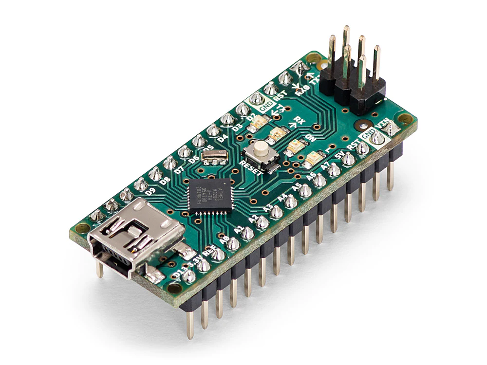

## E110 - Arduino Nano V3.0

## Description    

Arduino Nano V3.0

## Library Options

| Status: | Inactive |
| Min Qty: | 0 |
| Layout | Other | 

## Technical Information

| Data Sheet: | [Arduino Nano](https://store-usa.arduino.cc/products/arduino-nano?selectedStore=us) |
| Pin Layout: | [Nano Pinout.pdf](https://content.arduino.cc/assets/Pinout-NANO_latest.pdf) |
| PCB Files: | [Eagle Files](https://content.arduino.cc/assets/Nano-reference.zip) |
| CAD Files: | None |

## Supplier Information

| Supplier: | Arduino |
| Part #: | A000005 |         
| Pkg Count: | 1 |
| Pkg Price: | $24.90 |

## Tips & Techniques

