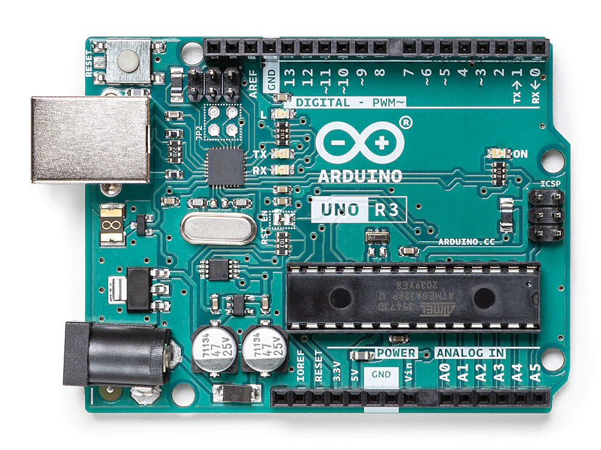

## E111 - Arduino Uno

## Description    

Arduino Uno

## Library Options

| Status: | Inactive |
| Min Qty: | 0 |
| Layout | Arduino | 

## Technical Information

| Data Sheet: | [Arduino Uno](https://store-usa.arduino.cc/collections/boards/products/arduino-uno-rev3) |
| Pin Layout: | [Uno Pinout](https://content.arduino.cc/assets/A000066-full-pinout.pdf) |
| PCB Files: | None |
| CAD Files: | [Eagle PCB](https://content.arduino.cc/assets/UNO-TH_Rev3e-reference.zip) |

## Supplier Information

| Supplier: | Adafruit |
| Part #: | A000066 |         
| Pkg Count: | 1 |
| Pkg Price: | $27.60 |

## Tips & Techniques

