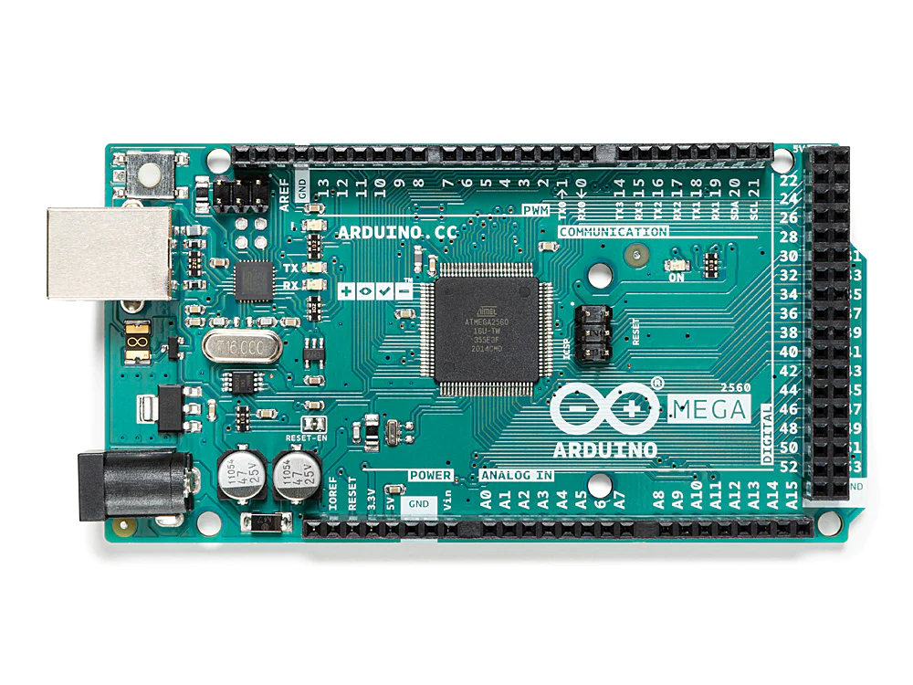

## E112 - Arduino Mega

## Description    
Arduino Mega

## Library Options

| Status: | Inactive |
| Min Qty: | 0 |
| Layout | Arduino | 

## Technical Information

| Data Sheet: | [Arduino Mega](https://store-usa.arduino.cc/collections/boards/products/arduino-mega-2560-rev3) |
| Pin Layout: | [Mega Pinout](https://content.arduino.cc/assets/Pinout-Mega2560rev3_latest.pdf) |
| PCB Files: | None |
| CAD Files: | None |

## Supplier Information

| Supplier: | Arduino |
| Part #: | A000067 |         
| Pkg Count: | 1 |
| Pkg Price: | $48.40 |

## Tips & Techniques

