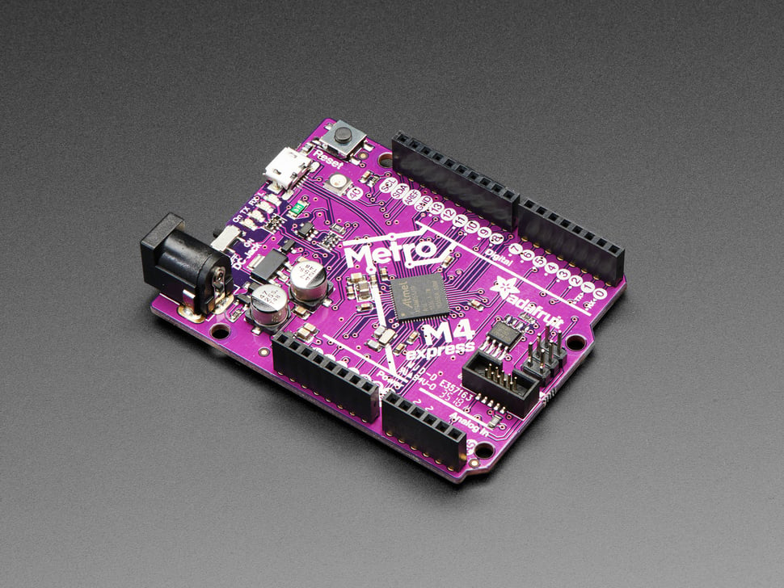

## E113 - Adafruit Metro M4

## Description    

Adafruit Metro M4

## Library Options

| Status: | Active |
| Min Qty: | 10 |
| Layout | Arduino | 

## Technical Information

| Data Sheet: | [Adafruit Metro M4](https://learn.adafruit.com/adafruit-metro-m4-express-featuring-atsamd51) |
| Pin Layout: | [Metro Pinout](https://github.com/adafruit/Adafruit-Metro-M4-Express-PCB/blob/master/Adafruit%20Metro%20M4%20Express%20Pinout.pdf) |
| PCB Files: | [Eagle Metro M4](https://github.com/adafruit/Adafruit-Metro-M4-Express-PCB) |
| CAD Files: | [Metro M4](https://github.com/adafruit/Adafruit_CAD_Parts/tree/main/3382%20Metro%20M4) |

## Supplier Information

| Supplier: | Adafruit |
| Part #: | 3382 |         
| Pkg Count: | 1 |
| Pkg Price: | $27.50 |

## Tips & Techniques

