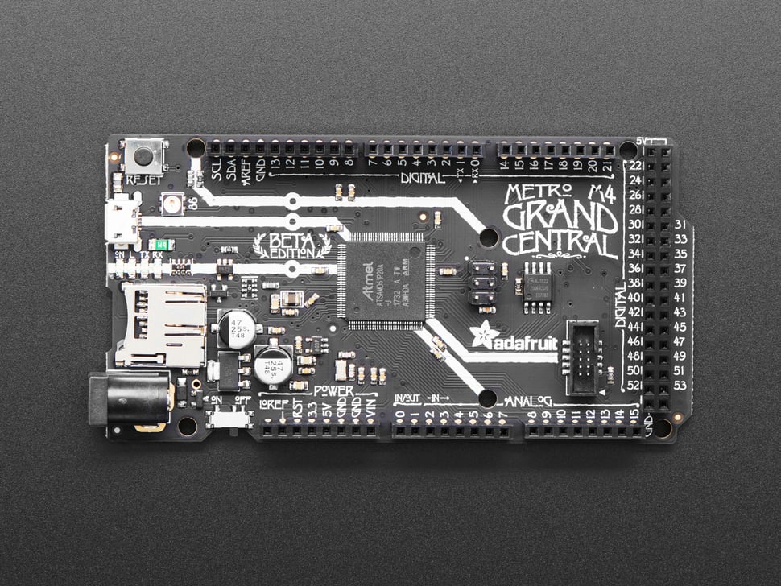

## E114 - Adafruit Grand Central M4

## Description    

Adafruit Grand Central M4

## Library Options

| Status: | Active |
| Min Qty: | 2 |
| Layout | Arduino | 

## Technical Information

| Data Sheet: | [Grand Central M4](https://learn.adafruit.com/adafruit-grand-central) |
| Pin Layout: | [Grand Central Pinout](https://github.com/adafruit/Adafruit-Grand-Central-PCB/blob/master/Adafruit%20Grand%20Central%20M4%20Express%20Pinout.pdf) |
| PCB Files: | [Eagle Metro M4](https://github.com/adafruit/Adafruit-Grand-Central-PCB) |
| CAD Files: | None |

## Supplier Information

| Supplier: | Adafruit |
| Part #: | 4064 |         
| Pkg Count: | 1 |
| Pkg Price: | $39.95 |

## Tips & Techniques

