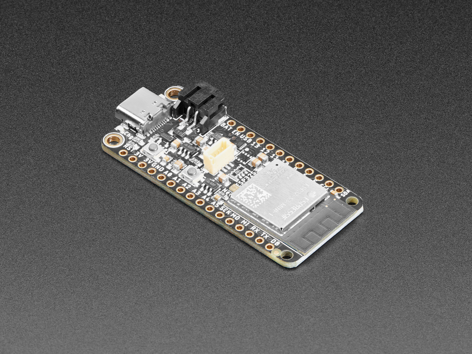

## E122 - Feather ESP32-S3

## Description    

Feather ESP32-S3

## Library Options

| Status: | Active |
| Min Qty: | 10 |
| Layout | Feather | 

## Technical Information

| Data Sheet: | [Feather ESP32-S3](https://learn.adafruit.com/adafruit-esp32-s3-feather) |
| Pin Layout: | [Feather ESP32-S3 Pins](https://learn.adafruit.com/adafruit-esp32-s3-feather/pinouts) |
| PCB Files: | [Feather ESP32-S3 Eagle](https://github.com/adafruit/Adafruit-Feather-ESP32-S2-PCB)  |
| CAD Files: | None |

## Supplier Information

| Supplier: | Adafruit |
| Part #: | 5323 |         
| Pkg Count: | 1 |
| Pkg Price: | $17.50 |

## Tips & Techniques

