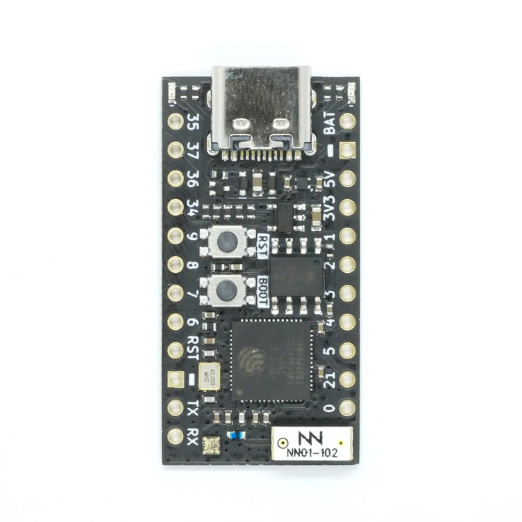

## E130 - TinyS3 ESP32-S3

## Description    

TinS3 ESP32-S3

## Library Options

| Status: | Inactive |
| Min Qty: | 0 |
| Layout | Other | 

## Technical Information

| Data Sheet: | [PiZero Pins](https://cdn.sparkfun.com/assets/learn_tutorials/6/7/6/PiZero_1.pdf) |
| Pin Layout: | [PiZero Pins](https://cdn.sparkfun.com/assets/learn_tutorials/6/7/6/PiZero_1.pdf) |
| PCB Files: | None |
| CAD Files: | [PiZero CAD](https://github.com/lciscon/IPL-Microlab/tree/main/Components/Elec/CAD/E121%20-%20raspberry-pi-zero-w) |

## Supplier Information

| Supplier: | Sparkfun |
| Part #: | 14277 |         
| Pkg Count: | 1 |
| Pkg Price: | $10.00 |

## Tips & Techniques

