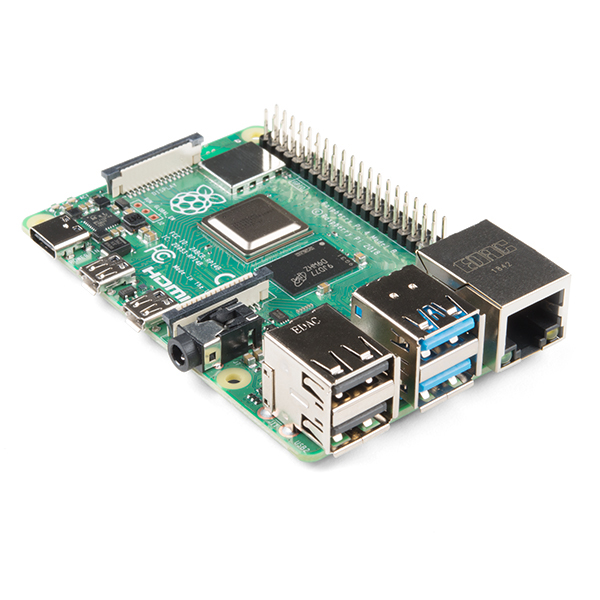

## E153 Raspberry Pi 4B

## Description    

Raspberry Pi 4B

## Library Options

| Status: | Active |
| Min Qty: | 5 |
| Layout | RasPi | 

## Technical Information

| Data Sheet: | [RasPi 3B Info](https://cdn.sparkfun.com/assets/d/a/c/4/8/Raspberry-Pi-4-Product-Brief.pdf) |
| Pin Layout: | [RasPi 3B Pins](Components/E - Electrical/CAD/E152/j8header-3b.png) |
| PCB Files: | None |
| CAD Files: | None |

## Supplier Information

| Supplier: | Sparkfun |
| Part #: | DEV-16811 |         
| Pkg Count: | 1 |
| Pkg Price: | $75.00 |

## Tips & Techniques

| Sparkfun | [RasPI] (https://www.sparkfun.com/raspberry_pi) |

