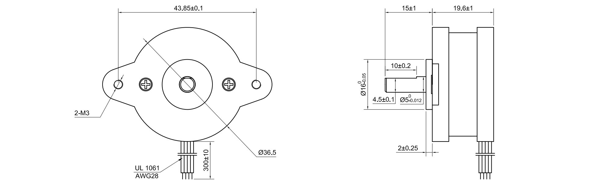
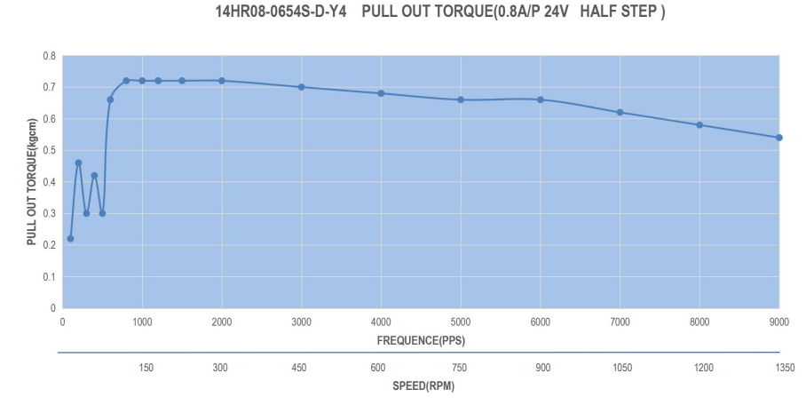

## Nema 14, Round, IPL Standard

 

 

## Description   

 

A class of Nema 14 motors based on 14HR08-0654S

 

## Library Options

 

| Status: | Inactive |

| Min Qty: | 0 |

| Layout | Other |

 

## Technical Information

| Voltage: | 4.6 V |

| Amps per Phase: | .65 Amps |

| Step Angle: | .9° |

| Steps per Revolution: | 400 |

| Holding Torque: | .08 Nm |

| Polarity: | Bipolar |

| Shaft Type: | D |

| Shaft Diameter: | 4.5 mm |
 
 
 

## Supplier Information

 

| Supplier: | Misc |

| Part #: | NA |        

| Pkg Count: | NA |

| Pkg Price: | NA |