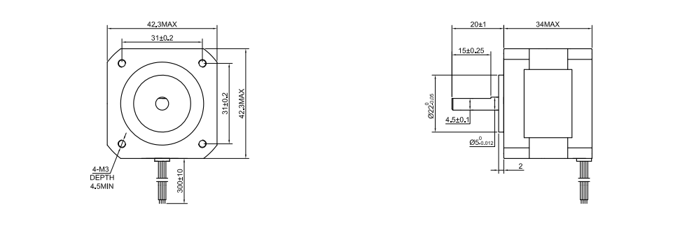

## E310 - Nema 17, IPL Standard

 

 

## Description   

 

A class of Nema 17 motors based on the 17HS13-0404S.

 

## Library Options

 

| Status: | Active |

| Min Qty: | 0 |

| Layout | Other |

 

## Technical Information

 

| Voltage: | 12V |

| Amps per Phase: | .4 Amps |

| Step Angle: | 1.8° |

| Steps per Revolution: | 200 |

| Holding Torque: | .26Nm |

| Pkg Price: | NA |
 

## Supplier Information

 

| Supplier: | Misc |

| Part #: | NA |        

| Pkg Count: | NA |

| Pkg Price: | NA |