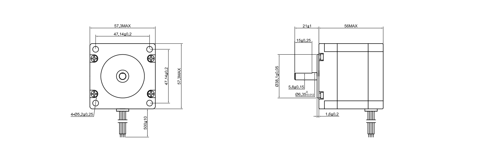
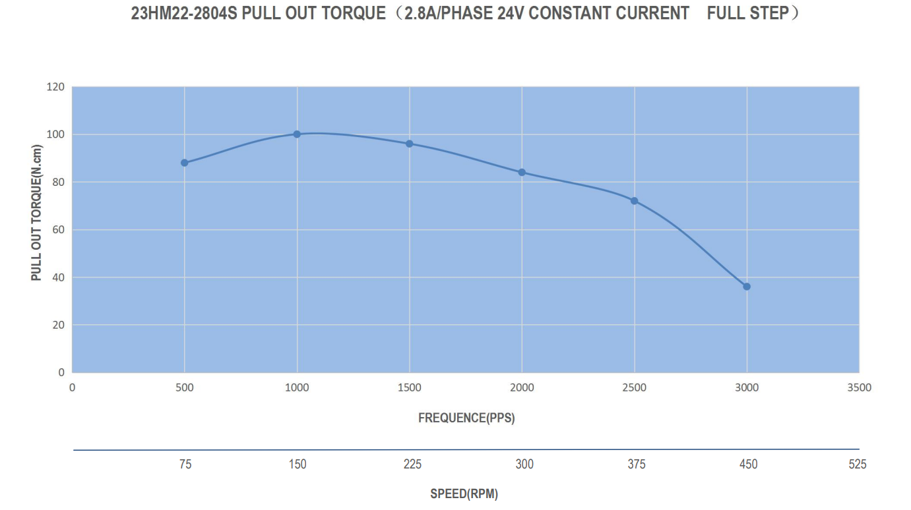

## E313 - Misc. Stepper

 

 

## Description   

 

A selection of various Stepper Motors. If it doesn't fit into the other categories, you can find it here!

 

## Library Options

 

| Status: | Active |

| Min Qty: | 0 |

| Layout | Other |

 

## Technical Information

| Voltage: | 2.5 V |

| Amps per Phase: | 2.8 Amps |

| Step Angle: | .9° |

| Steps per Revolution: | 400 |

| Holding Torque: | 1.2 Nm |

| Polarity: | Bipolar |

| Shaft Type: | D |

| Shaft Diameter: | 5.8 mm |
 

## Supplier Information

 

| Supplier: | omc-stepperonline.com |

| Part #: | 23HM22-2804S |        

| Pkg Count: | 1 |

| Pkg Price: | 17.30 |