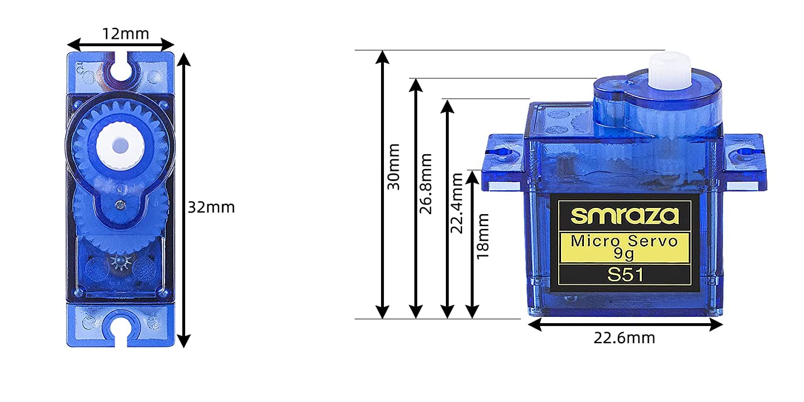

## E320 - 9G Micro Servo, Non-Continuous, IPL Standard

 

 

## Description   

 

A class of servos based on the S51 9g by smaraza.

## Links   

[How Do Servo Motors Work](https://www.youtube.com/watch?v=LXURLvga8bQ)

[Controlling Servo Motors](https://docs.arduino.cc/learn/electronics/servo-motors)
 

## Library Options

 

| Status: | Active |

| Min Qty: | 0 |

| Layout | Other |

 

## Technical Information

| Voltage: | 4.8 V - 6 V |

| Range: | 180° |

| Stall Torque: | 1 kg-cm |

| Operating Speed: | 60° in .08 sec |

| Type: | Non-Continous |

| Shaft Type: | 22 Spline |

## Supplier Information

 

| Supplier: | Amazon |

| Part #: | B07L2SF3R4 |        

| Pkg Count: | 10 |

| Pkg Price: | $19.98 |