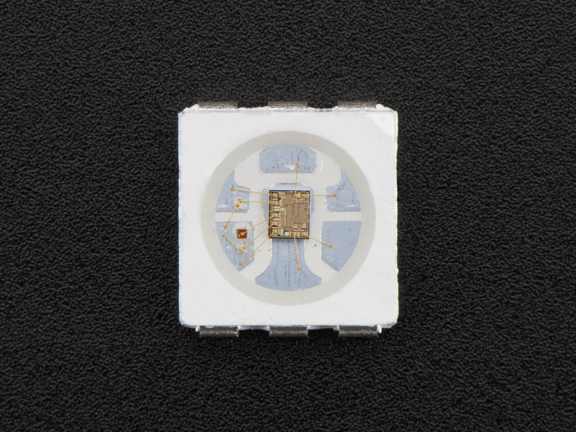

## E510 - Adafruit DotStar adressable 5050 RGB LED with intergrated driver, Surface Mount

## Description    

Individually adressable LEDs with an embedded microcontroller, in a 5mm x 5mm footprint.

## Library Options

| Status: | Active |
| Min Qty: | 30 |
| Layout | DotStar | 

## Technical Information

| Data Sheet: | [Adafruit DotStar 5050](https://cdn-shop.adafruit.com/product-files/2343/SK9822_SHIJI.pdf) |
| Pin Layout: | [image](CAD/E510/pinlayout.png)
| PCB Files: | None |
| CAD Files: | [name](https://URL) |

## Supplier Information

| Supplier: | Adafruit |
| Part #: | 2343 |         
| Pkg Count: | 10 |
| Pkg Price: | $4.50 |

## Tips & Techniques

[Adafruit DotStar LEDs](https://learn.adafruit.com/adafruit-dotstar-leds?view=all)