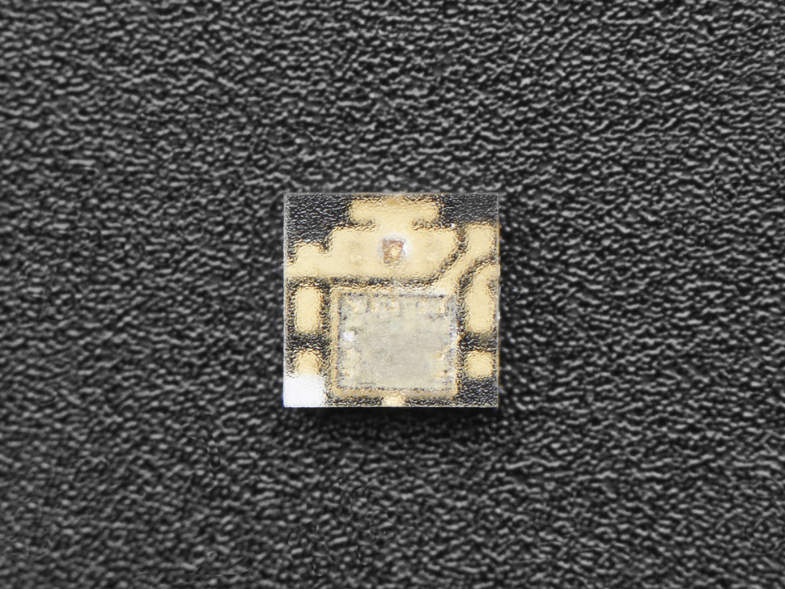

## E511 - DotStar Style Addressable 2020 RGB Micro LED with Integrated Driver, Surface Mount

## Description    

Individually addressable LEDs with high speed PWM and a two-wire interface, in a 2mm x 2mm footprint.

## Library Options

| Status: | Active |
| Min Qty: | 30 |
| Layout | DotStar |

## Technical Information

| Data Sheet: | [APA102-2020 Super LED](https://cdn-shop.adafruit.com/product-files/3341/3341_APA102-2020+SMD+LED.pdf) |
| Pin Layout: | [APA102-2020 Super LED Pins](https://cdn-shop.adafruit.com/product-files/3341/Datasheet.png) |
| PCB Files: | None |
| CAD Files: | [name](https://URL) |

## Supplier Information

| Supplier: | Adafruit |
| Part #: | 3341 |
| Pkg Count: | 10 |
| Pkg Price: | $5.95 |

## Tips & Techniques

[Adafruit DotStar LEDs](https://learn.adafruit.com/adafruit-dotstar-leds?view=all)
