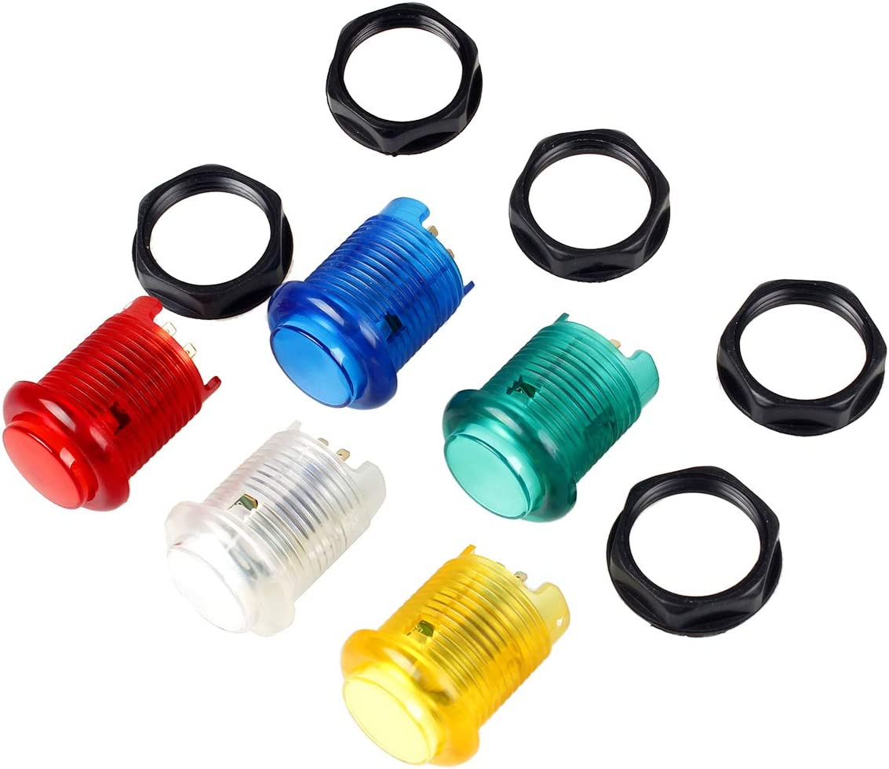

## E611 - Push Button, Momentary, LED Arcade Style
 

 

## Description   

 

Pressing down on the button connects two of the leads closing the circuit between them. When released contunity is broken. Has an additional two leads to provide power to an LED light inside the button. 

## Links   

## Library Options

 

| Status: | Active |

| Min Qty: | 10 |

| Layout | Other |

 

## Technical Information

| Voltage: | 5 V |

| Data Sheet: | N/A |

## Supplier Information

| Supplier: | Amazon |

| Part #: | B01N11BDX9 |        

| Pkg Count: | 5 |

| Pkg Price: | $11.88 |