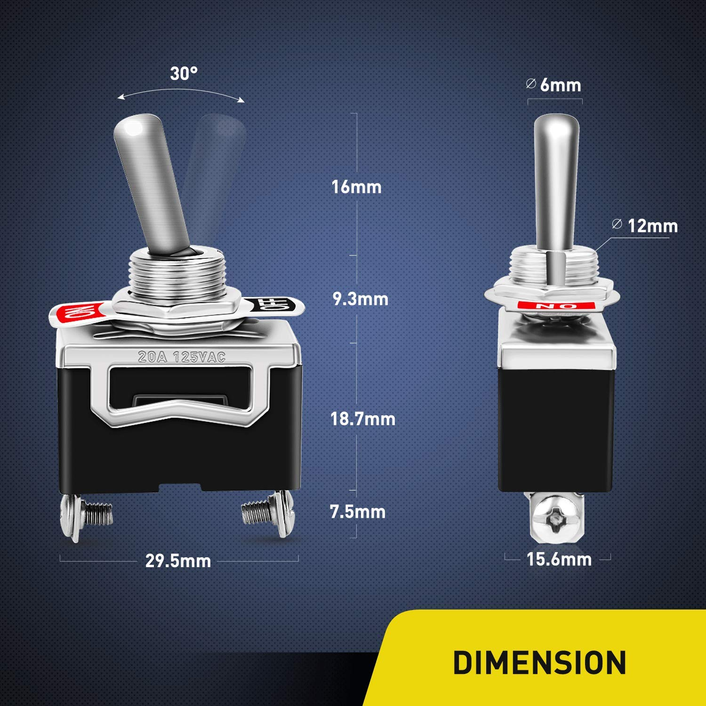

## E621 - Toggle Switch, 2 Way, Large
 

 

## Description   

 

Can be spun in either direction without limit. Clicks 20 times per roatation. Each rotation sends a pulse which can be interperated as a direction by the Micro Controller. Knob can be clicked to reset relative position to zero. Commonly used to navigate menus on barebones user interfaces such as Prusas

## Links   

## Library Options

 

| Status: | Active |

| Min Qty: | 10 |

| Layout | Other |

 

## Technical Information

| Voltage: | 5 V |

| Data Sheet: | [KY-040](CAD/E621/datasheet.pdf) |

## Supplier Information

 

| Supplier: | Amazon |

| Part #: | B07F26CT6B |        

| Pkg Count: | 5 |

| Pkg Price: | $9.99 |