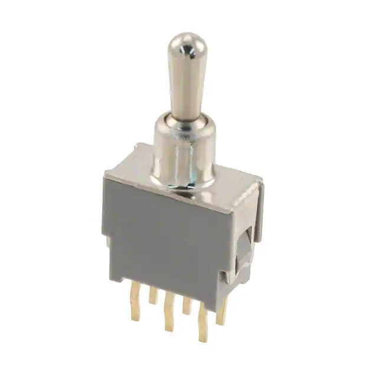
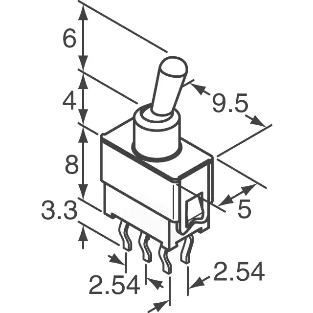

## E622 - Toggle Switch, 3 Way, Micro
 

 

## Description   

 

Netural position in the middle leaves all leads disconected. Flipping the switch in either up or down connects different leads closing the circuit between them.

## Links   

## Library Options

 

| Status: | Active |

| Min Qty: | 10 |

| Layout | Other |

 

## Technical Information

| Voltage AC/DC: | 48 V |

| Amperage AC/DC: | .05 A |

| Data Sheet: | [ATE Subminiature Toggle Switch](CAD/E622/datasheet.pdf) |

## Supplier Information

 

| Supplier: | Digi-Key |

| Part #: | 563-1164-ND |        

| Pkg Count: | 1 |

| Pkg Price: | $5.52 |