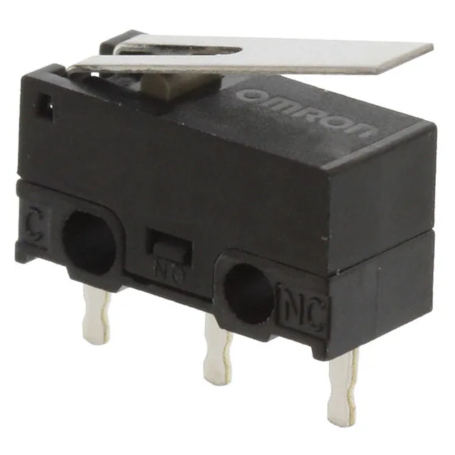
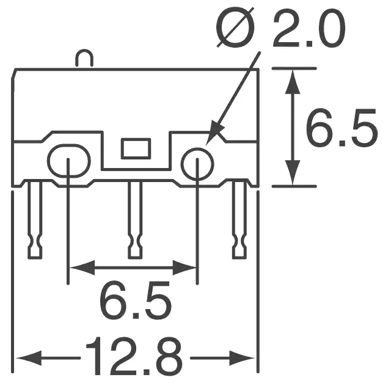

## E623 - Micro Switch (Limit Switch)
 

 

## Description   

 

Pressing down on the smalll lever connects two of the leads closing the circuit between them. When released contunity is broken.

## Links   

## Library Options

 

| Status: | Active |

| Min Qty: | 10 |

| Layout | Other |

 

## Technical Information

| Voltage DC: | 30 V |

| Amperage DC: | .5 A |

| Operating Force: | 80 gf |

| Data Sheet: | [D2F-01L](CAD/E623/datasheet.pdf) |

## Supplier Information

 

| Supplier: | Digi-Key |

| Part #: | SW154-ND |        

| Pkg Count: | 1 |

| Pkg Price: | $2.06 |