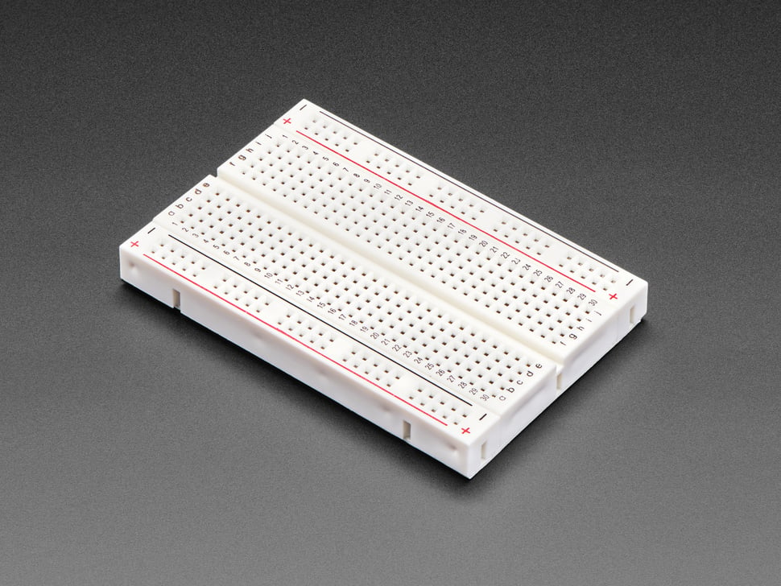

## E810 - Half Sized Solderless Breadboard

 

 

## Description   

 

Half-size breadboard with 400 tie points, good for small projects. It's 3.25" x 2.2" / 8.3cm x 5.5cm with a standard double-strip in the middle and two power rails on both sides. You can pull the power rails off easily to make the breadboard as thin as 1.4" (3.5cm). You can also "snap" these breadboards together, either way, to make longer and/or wider breadboards. The back is made of foam double-sided tape, if you remove the protective paper you can attach it to a flat clean surface.

 

## Library Options

 

| Status: | Active |

| Min Qty: | 0 |

| Layout | Other |

 

## Supplier Information

 

| Supplier: | Amazon |

| Part #: | B082VYXDF1 |        

| Pkg Count: | 6 |

| Pkg Price: | $12.99 |