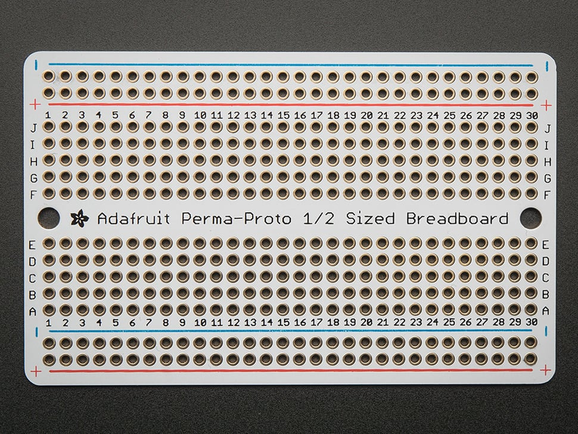

## E812 - Perma-Proto Half-sized Breadboard PCB

 

 

## Description   

 

Basic layout of a half-sized breadboard and turned that into a beautiful PCB. The bottom has the 5-hole pad design that matches a classic breadboard, with 4 power bus lines on the sides, and no mask so you can easily cut traces when necessary.

 

## Library Options

 

| Status: | Active |

| Min Qty: | 0 |

| Layout | Other |

 

## Supplier Information

 

| Supplier: | Adafruit |

| Part #: | 571 |        

| Pkg Count: | 3 |

| Pkg Price: | $12.50 |