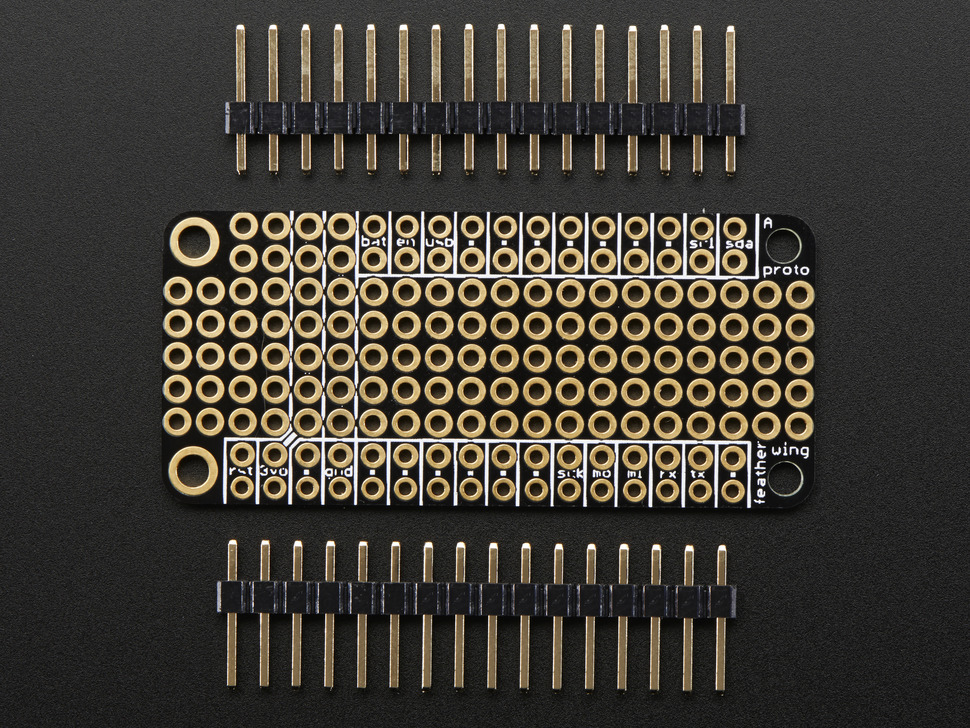
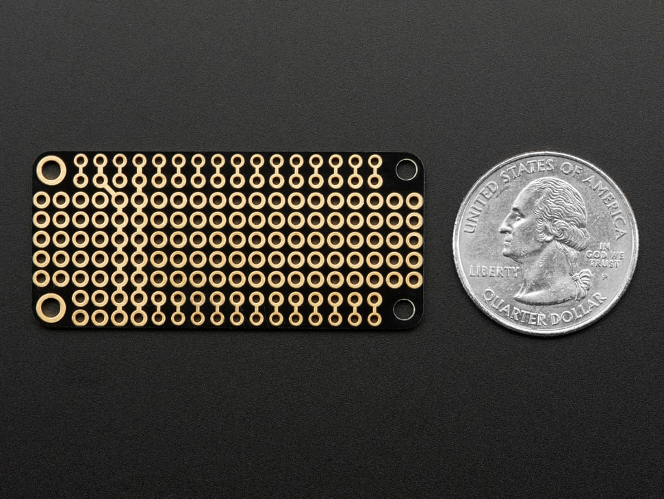

## E813 - FeatherWing Proto

 

 

## Description   

 

Prototyping Add-on For All Feather Boards - This has a duplicate breakout for each pin on a Feather, as well as a bunch of plain grid proto holes. For GND and 3.3V, we give you a strip of connected pads. There's plenty of room for buttons, indicator LEDs, or anything for your portable project. The FeatherWing Proto makes an ideal partner for any of our Feather boards.

 

## Library Options

 

| Status: | Active |

| Min Qty: | 0 |

| Layout | Other |

 

## Supplier Information

 

| Supplier: | Adafruit |

| Part #: | 2884 |        

| Pkg Count: | 1 |

| Pkg Price: | $4.95 |