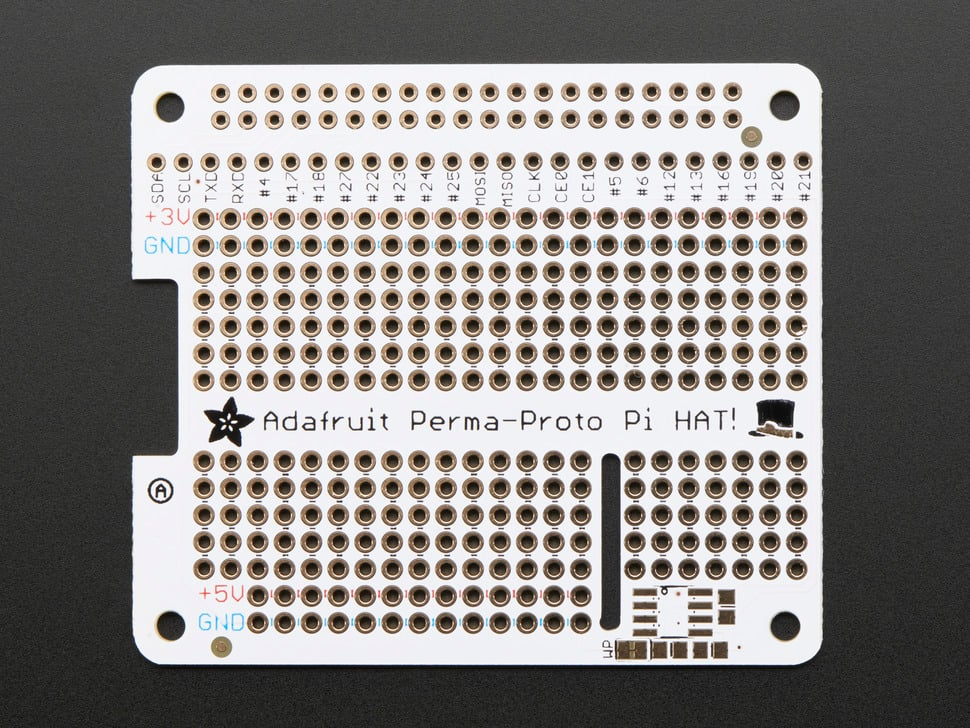
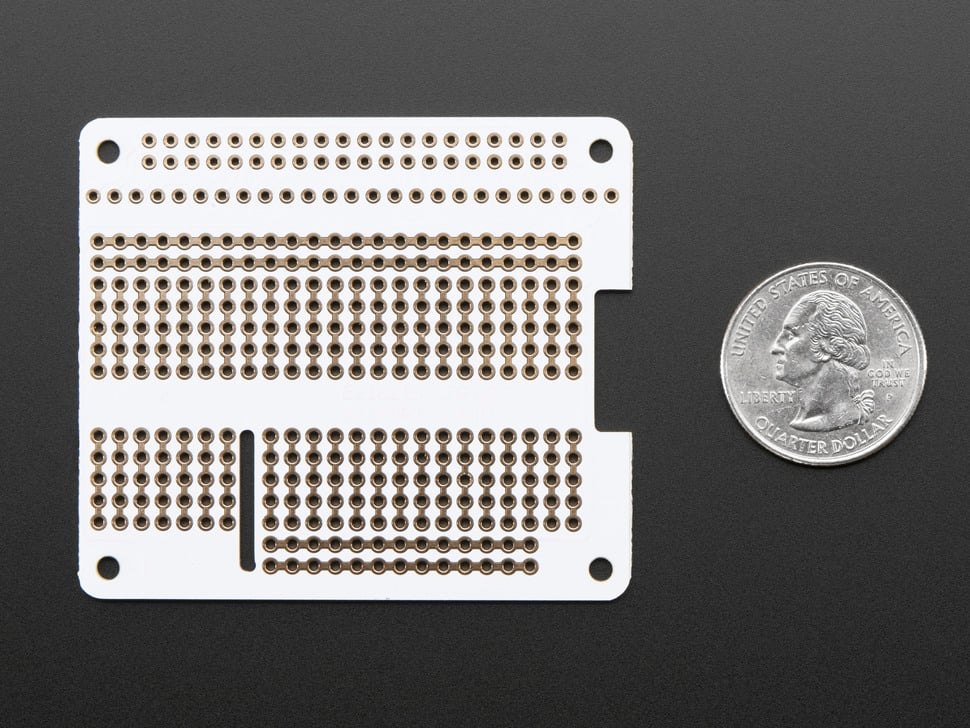

## E813 - Perma-Proto HAT for Pi Mini Kit - No EEPROM

 

 

## Description   

 

Design your own Pi HAT, attach custom circuitry and otherwise dress your Pi Zero, A+, B+, Pi 2, Pi 3 and Pi 4 (any Pi with a 2x20 connector)

Perma-Proto inspired plug in daughter board. It has a grid of 0.1" prototyping soldering holes for attaching chips, resistors, LED, potentiometers and more. The holes are connected underneath with traces to mimic the solderless breadboards with which you're familiar. There's also long power strips for +3V, +5V and Ground connections to the Pi. Near the top we break out nearly every pin you could want to connect to the Pi (#26 didn't quite make the cut).

 

## Library Options

 

| Status: | Active |

| Min Qty: | 0 |

| Layout | Other |

 

## Supplier Information

 

| Supplier: | Adafruit |

| Part #: | 2310 |        

| Pkg Count: | 1 |

| Pkg Price: | $4.95 |